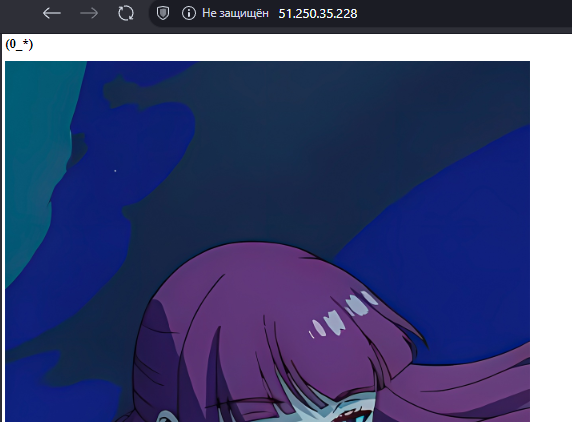
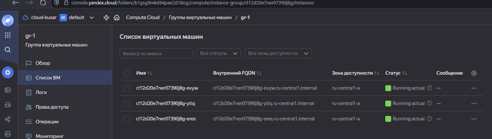
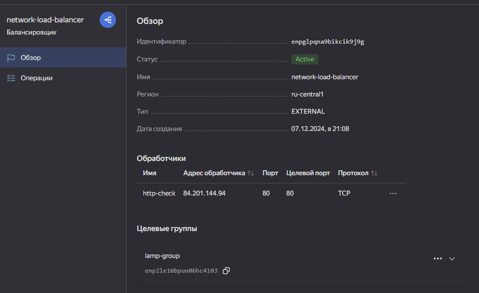
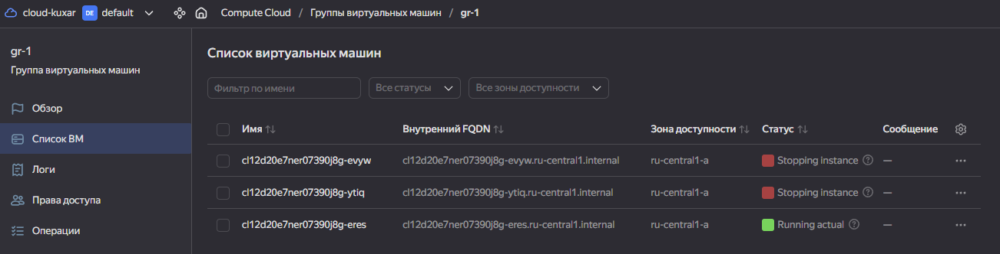
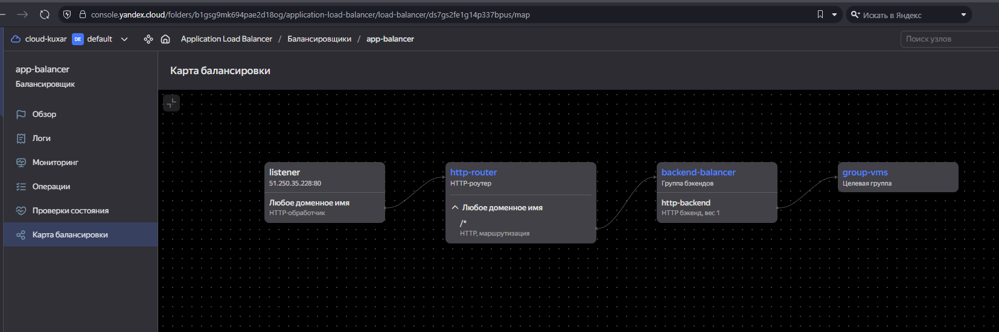
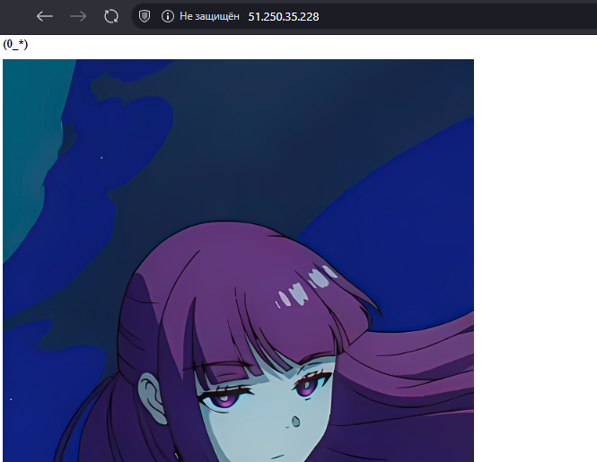

Что нужно сделать

1.Создать бакет Object Storage и разместить в нём файл с картинкой:
Создать бакет в Object Storage с произвольным именем (например, имя_студента_дата).
Положить в бакет файл с картинкой.
Сделать файл доступным из интернета.
2.Создать группу ВМ в public подсети фиксированного размера с шаблоном LAMP и веб-страницей, содержащей ссылку на картинку из бакета:
Создать Instance Group с тремя ВМ и шаблоном LAMP. Для LAMP рекомендуется использовать image_id = fd827b91d99psvq5fjit.
Для создания стартовой веб-страницы рекомендуется использовать раздел user_data в meta_data.
Разместить в стартовой веб-странице шаблонной ВМ ссылку на картинку из бакета.
Настроить проверку состояния ВМ.
3.Подключить группу к сетевому балансировщику:
Создать сетевой балансировщик.
Проверить работоспособность, удалив одну или несколько ВМ.
4.(дополнительно)* Создать Application Load Balancer с использованием Instance group и проверкой состояния.
Полезные документы:

[Compute instance group.](https://registry.terraform.io/providers/yandex-cloud/yandex/latest/docs/resources/compute_instance_group)
[Network Load Balancer.](https://registry.terraform.io/providers/yandex-cloud/yandex/latest/docs/resources/lb_network_load_balancer)
[Группа ВМ с сетевым балансировщиком.](https://cloud.yandex.ru/docs/compute/operations/instance-groups/create-with-balancer)

1. Создаем сервисный аккаунт для управления бакетом.

```
resource "yandex_iam_service_account" "service" {
  folder_id = var.folder_id
  name      = "bucket-sa"
}

// Назначение роли сервисному аккаунту
resource "yandex_resourcemanager_folder_iam_member" "bucket-editor" {
  folder_id = var.folder_id
  role      = "storage.editor"
  member    = "serviceAccount:${yandex_iam_service_account.service.id}"
  depends_on = [yandex_iam_service_account.service]
}

// Создание статического ключа доступа
resource "yandex_iam_service_account_static_access_key" "sa-static-key" {
  service_account_id = yandex_iam_service_account.service.id
  description        = "static access key for object storage"
}
```

Далее создаем сам бакет.

```
resource "yandex_storage_bucket" "kuxar" {
  access_key = yandex_iam_service_account_static_access_key.sa-static-key.access_key
  secret_key = yandex_iam_service_account_static_access_key.sa-static-key.secret_key
  bucket = local.bucket_name
  acl    = "public-read"
}

resource "yandex_storage_object" "picture" {
  access_key = yandex_iam_service_account_static_access_key.sa-static-key.access_key
  secret_key = yandex_iam_service_account_static_access_key.sa-static-key.secret_key
  bucket = local.bucket_name
  key    = "4KidiimblKo.jpg"
  source = "png/4KidiimblKo.jpg"
  acl = "public-read"
  depends_on = [yandex_storage_bucket.kuxar]
}
```
Файл доступен из интернета..



2.Создаем сеть

```
resource "yandex_vpc_network" "vpc" {
  name = var.vpc_name
}

resource "yandex_vpc_subnet" "public" {
  name           = var.sab_vpc_name
  zone           = var.default_zone
  network_id     = yandex_vpc_network.vpc.id
  v4_cidr_blocks = var.public_cidr
}

```

После создаем Instance Group с тремя ВМ содержащей ссылку на картинку из бакета в user data

```
resource "yandex_iam_service_account" "groupvm-sa" {
  name        = "groupvm-sa"
  description = "Сервисный аккаунт для управления группой ВМ."
}

resource "yandex_resourcemanager_folder_iam_member" "group-editor" {
  folder_id  = var.folder_id
  role       = "editor"
  member     = "serviceAccount:${yandex_iam_service_account.groupvm-sa.id}"
  depends_on = [
    yandex_iam_service_account.groupvm-sa,
  ]
}


resource "yandex_compute_instance_group" "group-vms" {
  depends_on          = [yandex_resourcemanager_folder_iam_member.group-editor]
  name                = var.yandex_compute_instance_groupvms[0].name
  folder_id           = var.folder_id
  service_account_id  = "${yandex_iam_service_account.groupvm-sa.id}"
  deletion_protection = "false"
  
  instance_template {
    platform_id = var.yandex_compute_instance_groupvms[0].platform_id
    resources {
      memory = var.yandex_compute_instance_groupvms[0].memory
      cores  = var.yandex_compute_instance_groupvms[0].cores
      core_fraction = var.yandex_compute_instance_groupvms[0].core_fraction
    }

  boot_disk {
    initialize_params {
      image_id = var.boot_disk[0].image_id
      type     = var.boot_disk[0].type
      size     = var.boot_disk[0].size
    }
  }
    network_interface {
      network_id         = "${var.id}"
      subnet_ids         = ["${var.subnet_ids}"]
      nat = true
    }

  scheduling_policy {
    preemptible = true
  }

    metadata = {
    ssh-keys = "ubuntu:${local.ssh-keys}"
    serial-port-enable = "1"
    user-data  = <<EOF
#!/bin/bash
cd /var/www/html
echo '<html><head><title>(0_0)</title></head> <body><h1>(0_*)</h1></body></html>' > index.html
EOF
    }
  }

  scale_policy {
    fixed_scale {
      size = 3
    }
  }

  allocation_policy {
    zones = [var.default_zone]
  }

  deploy_policy {
    max_unavailable = 1
    max_expansion   = 0
  }

  health_check {
    interval = 30
    timeout  = 10
    tcp_options {
      port = 80
    }
  }

    load_balancer {
        target_group_name = "lamp-group"
    }
    
}

```
Группа успешно создалась




3. Создаем сетевой балансировщик и подключаем Instance Group созданную ранее
```
resource "yandex_lb_network_load_balancer" "balancer" {
  name = "network-load-balancer"
  deletion_protection = "false"
  listener {
    name = "http-check"
    port = 80
    external_address_spec {
      ip_version = "ipv4"
    }
  }
  attached_target_group {
    target_group_id = var.target_group_id
    healthcheck {
      name = "http"
      interval = 2
      timeout = 1
      unhealthy_threshold = 2
      healthy_threshold = 5
      http_options {
        port = 80
        path = "/"
      }
    }
  }
}
```
Успешно создан сетевой балансировщик



При отключении вм 1-2 из целевой группы картинка также загружается.




4. Создаем Application Load Balancer с использованием Instance group
```
//целевая группа
resource "yandex_alb_target_group" "alb-group" {
  name           = "group-vms"

  target {
    subnet_id    = var.subnet_ids
    ip_address   = var.group_wm1
  }

  target {
    subnet_id    = var.subnet_ids
    ip_address   = var.group_wm2
  }

  target {
    subnet_id    = var.subnet_ids
    ip_address   = var.group_wm3
  }
/*
  depends_on = [
    yandex_compute_instance_group.group-vms
]
*/
}

//группа бэкенда
resource "yandex_alb_backend_group" "backend-group" {
    depends_on = [
    yandex_alb_target_group.alb-group
]
  name                     = "backend-balancer"
  session_affinity {
    connection {
      source_ip = true
    }
  }

  http_backend {
    name                   = "http-backend"
    weight                 = 1
    port                   = 80
    target_group_ids       = [yandex_alb_target_group.alb-group.id]
    load_balancing_config {
      panic_threshold      = 90
    }    
    healthcheck {
      timeout              = "10s"
      interval             = "2s"
      healthy_threshold    = 10
      unhealthy_threshold  = 15 
      http_healthcheck {
        path               = "/"
      }
    }
  }

}
//HTTP-роутер

resource "yandex_alb_http_router" "http-router" {
  name          = "http-router"
  labels        = {
    tf-label    = "tf-label-value"
    empty-label = ""
  }
}

resource "yandex_alb_virtual_host" "my-virtual-host" {
  name                    = "virtual-host"
  http_router_id          = yandex_alb_http_router.http-router.id
  route {
    name                  = "route-http"
    http_route {
      http_route_action {
        backend_group_id  = yandex_alb_backend_group.backend-group.id
        timeout           = "60s"
      }
    }
  }
depends_on = [
    yandex_alb_backend_group.backend-group
]
}

//L7-балансировщик

resource "yandex_alb_load_balancer" "application-balancer" {
  name        = "app-balancer"
  network_id  = var.id

  allocation_policy {
    location {
      zone_id   = var.default_zone
      subnet_id = var.subnet_ids
    }
  }

  listener {
    name = "listener"
    endpoint {
      address {
        external_ipv4_address {
        }
      }
      ports = [ 80 ]
    }
    http {
      handler {
        http_router_id = yandex_alb_http_router.http-router.id
      }
    }
  }

 depends_on = [
    yandex_alb_http_router.http-router
] 
}
```

Application Load Balancer успешно создан и функционирует




